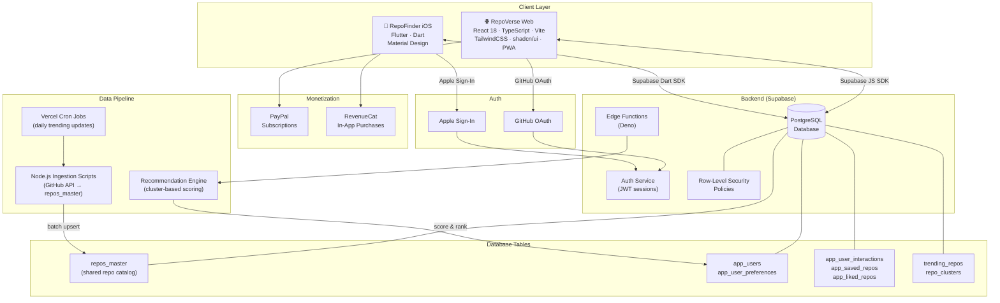
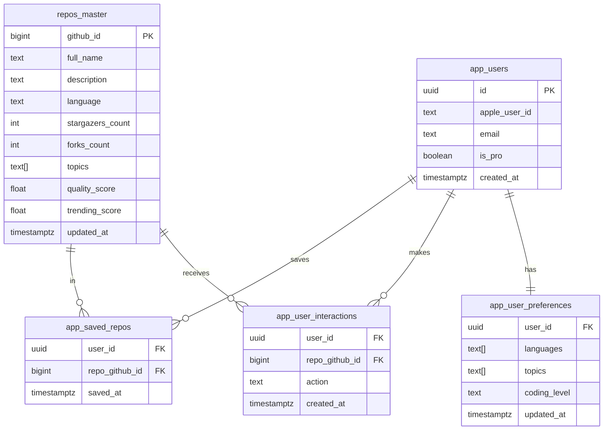
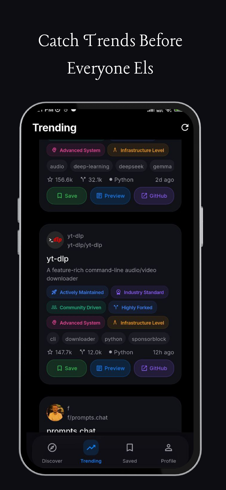
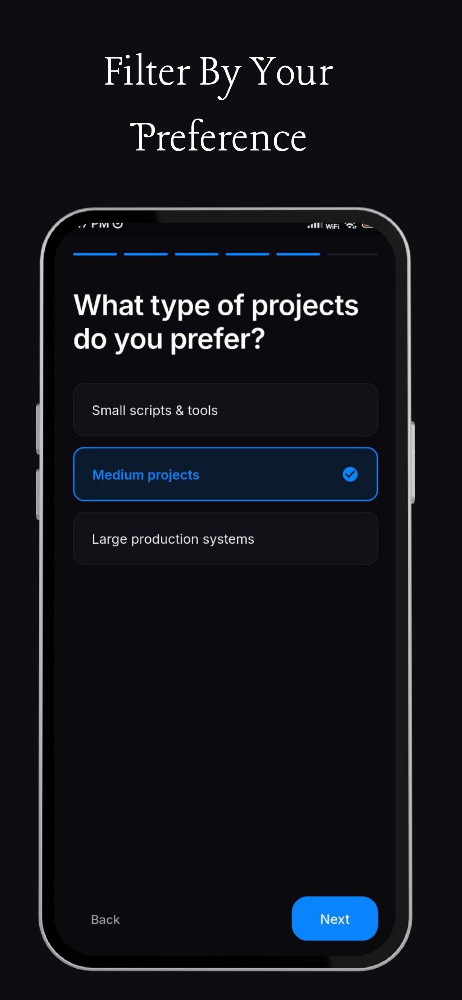

<div align="center">


# RepoVerse · RepoFinder

**Discover GitHub repositories you'll actually love — swipe, save, and explore.**

[](https://react.dev)
[](https://flutter.dev)
[](https://typescriptlang.org)
[](https://supabase.com)
[](https://vercel.com)
[](LICENSE)

<br/>


</div>

---

## What is this?

**RepoVerse** (web) and **RepoFinder** (iOS) are two connected apps that help developers discover hidden-gem GitHub repositories tailored to their interests — through a Tinder-style swipe interface, personalized recommendations, and a real-time trending feed.

- **Web app** → Runs in any browser as a PWA, sign in with GitHub OAuth
- **iOS app** → Native Flutter app, sign in with Apple, published to the App Store

Both apps share the same Supabase backend and a master repository database of curated GitHub repos.

---

## Features

| Feature | Web (RepoVerse) | iOS (RepoFinder) |
|---|:---:|:---:|
| Swipe-to-discover repos | ✅ | ✅ |
| Personalized recommendations | ✅ | ✅ |
| Trending repos feed | ✅ | ✅ |
| Save & like repos | ✅ | ✅ |
| Onboarding preference quiz | ✅ | ✅ |
| AI-powered discovery agent | ✅ | — |
| GitHub OAuth sign-in | ✅ | — |
| Apple Sign-In | — | ✅ |
| PayPal subscriptions | ✅ | — |
| RevenueCat in-app purchases | — | ✅ |
| PWA (installable) | ✅ | — |

---

## Architecture



---

## Database Schema



---

## Project Structure

```
Repo-finder/
├── src/                        # Web app source
│   ├── app/
│   │   └── components/         # React components
│   │       ├── DiscoveryScreen.tsx   # Swipe card UI
│   │       ├── TrendingScreen.tsx    # Trending feed
│   │       ├── ProfileScreen.tsx     # User profile
│   │       ├── PaywallModal.tsx      # Subscription gate
│   │       └── AgentScreen.tsx       # AI discovery agent
│   ├── services/               # API & business logic
│   │   ├── supabase.service.ts
│   │   ├── recommendation.service.ts
│   │   ├── github.service.ts
│   │   └── payment.service.ts
│   ├── hooks/                  # Custom React hooks
│   └── lib/                    # Supabase client, types
├── RepoFinderMobile/           # Flutter iOS app
│   └── lib/
│       ├── screens/            # App screens
│       │   ├── discovery_screen.dart
│       │   ├── trending_screen.dart
│       │   ├── saved_screen.dart
│       │   └── paywall_screen.dart
│       └── services/           # Flutter services
│           ├── app_supabase_service.dart
│           ├── auth_service.dart
│           ├── repo_service.dart
│           └── revenuecat_service.dart
├── scripts/                    # Data ingestion pipeline
│   └── ingest-*.js
├── server/                     # API server
└── public/                     # Static assets
```

---

## Screenshots

<div align="center">
<table>
  <tr>
    <td align="center"><br/><sub>Swipe Discovery</sub></td>
    <td align="center"><br/><sub>Trending Repos</sub></td>
    <td align="center"><br/><sub>Preferences</sub></td>
    <td align="center"><br/><sub>Coding Level</sub></td>
  </tr>
</table>
</div>

---

## Getting Started

### Web App

**Prerequisites:** Node.js 18+, a Supabase project, GitHub OAuth app, PayPal app

```bash
# Clone the repo
git clone https://github.com/mandanajignesh-byte/Repo-finder-.git
cd Repo-finder-

# Install dependencies
npm install

# Set up environment variables
cp env.example .env.local
# Fill in VITE_SUPABASE_URL, VITE_SUPABASE_ANON_KEY, VITE_PAYPAL_CLIENT_ID

# Start dev server
npm run dev
```

### iOS App (Flutter)

**Prerequisites:** Flutter 3.x, Xcode 15+, RevenueCat account, Supabase project

```bash
cd RepoFinderMobile

# Install Flutter packages
flutter pub get

# Run on iOS simulator
flutter run -d ios

# Build for release
flutter build ios --release
```

### Data Ingestion Pipeline

The `scripts/` directory contains Node.js scripts to populate `repos_master` from the GitHub API.

```bash
# Ingest repos by keyword/language clusters
node scripts/ingest-balanced.js

# Fetch and update daily trending
node scripts/fetch-daily-trending.js

# Compute recommendation scores
node scripts/compute-recommendations.js
```

---

## Tech Stack

### Web (RepoVerse)
| Layer | Technology |
|---|---|
| Framework | React 18 + TypeScript + Vite |
| UI | TailwindCSS + shadcn/ui + Radix UI |
| Auth | GitHub OAuth via Supabase |
| Backend | Supabase (PostgreSQL + RLS) |
| Payments | PayPal Subscriptions |
| Deployment | Vercel + Cron Jobs |
| Analytics | Vercel Analytics |

### Mobile (RepoFinder iOS)
| Layer | Technology |
|---|---|
| Framework | Flutter 3 + Dart |
| Auth | Apple Sign-In |
| Backend | Supabase Dart SDK |
| Payments | RevenueCat |
| Swipe UI | appinio_swiper |
| CI/CD | Codemagic |

---

## Contributing

1. Fork the repo
2. Create a feature branch: `git checkout -b feat/my-feature`
3. Commit your changes: `git commit -m 'feat: add my feature'`
4. Push and open a Pull Request

---

## License

MIT — see [LICENSE](LICENSE) for details.

---

<div align="center">
  <sub>Built with ❤️ by <a href="https://github.com/mandanajignesh-byte">mandanajignesh-byte</a></sub>
</div>
